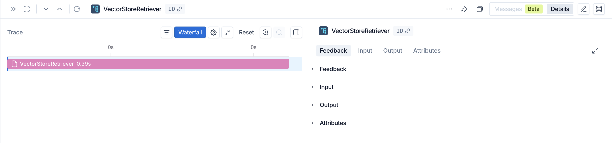

# financial-rag-agent-aws

## Business Problem
Financial analysts and compliance teams spend hours manually reviewing 10-Ks,
earnings transcripts, and regulatory filings to answer ad-hoc questions.
Answers are inconsistent, slow, and hard to audit. This assistant provides
grounded, cited answers from a structured corpus of SEC filings.

## Corpus Description
- **Sources:** SEC EDGAR 10-K filings.
- **Companies:** 5 financial institutions (Apple, JPMorgan, Goldman Sachs, Microsoft, Tesla).
- **Filing years:** 2025.
- **Ingestion:** PyPDFLoader → RecursiveCharacterTextSplitter.
- **Metadata per chunk:** ticker, company, filing_type, year, section, source_url.
- **Vector store:** Pinecone (sentence-transformers/all-MiniLM-L6-v2, 384 dims).
- **Total chunks indexed:** ~2500 chunks across 5 documents.

## Day 4 Retrieval Test Results
