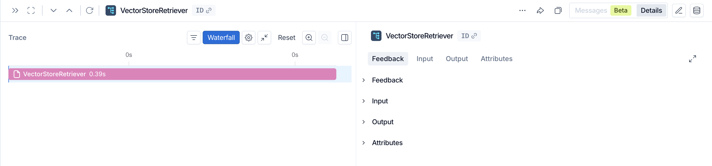
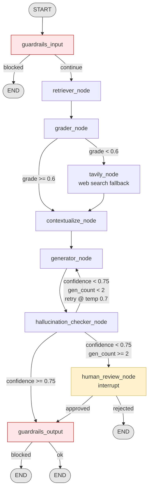
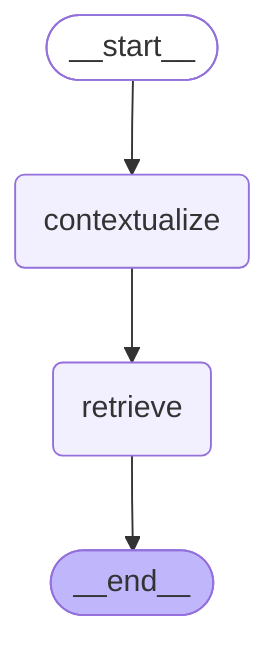

# Parsely
Parsely is an AI assistant that answers questions about company financial filings (10-Ks,internal documents and earnings call) instantly, with sources cited, so you don't have to dig through hundreds of pages yourself. It's built and tested to give accurate, trustworthy answers you can verify.

## Business Problem
Financial analysts and compliance teams spend hours manually reviewing 10-Ks,
earnings transcripts, and regulatory filings to answer ad-hoc questions.
Answers are inconsistent, slow, and hard to audit. This assistant provides
grounded, cited answers from a structured corpus of SEC filings.

## Corpus Description
1. **Sources:** SEC EDGAR 10-K Filings,Earnings Transcripts, Regulatory Filings.
2. **Companies:** 5 financial institutions (Apple, JPMorgan, Goldman Sachs, Microsoft, Tesla).
3. **Filing years:** 2025.
4. **Ingestion:** PyPDFLoader → RecursiveCharacterTextSplitter.
5. **Metadata per chunk:** ticker, company, filing_type, year, section, source_url.
6. **Vector store:** Pinecone (sentence-transformers/all-MiniLM-L6-v2, 384 dims).
7. **Total chunks indexed:** ~2500 chunks across 5 documents.

## Features

### Safety & Trust
1. **Input guardrails** — every query is screened before retrieval; unsafe or out-of-scope queries short-circuit to END without burning an LLM call.
2. **Output guardrails** — every generated answer is screened before it reaches the user. No path returns an answer that skipped this check.
3. **Grounding verification** — an LLM-as-judge compares the draft answer against the retrieved chunks and emits a confidence score. Answers below 0.75 never ship unreviewed.
4. **Source attribution** — every answer carries structured provenance: chunk ID, ticker, filing year, source document, and a text preview. Web-sourced answers carry title, URL, and preview instead.

### Retrieval Quality
1. **Relevance grading** — retrieved chunks are scored 0–1 for relevance to the question. Below an average of 0.6, the pipeline stops trusting the corpus.
2. **Web search fallback** — when the corpus can't answer (grade < 0.6), the query is routed to Tavily rather than forcing a hallucinated answer out of irrelevant chunks.
3. **Benchmarked strategy selection** — dense, sparse, hybrid, reranked, and Weaviate retrieval were evaluated on faithfulness, answer relevance, and context precision (see table above).

### Self-Correction
1. **Automatic regeneration** — a low-confidence answer triggers one retry at higher temperature (0.0 → 0.7) to sample a different response rather than repeating a deterministic failure.
2. **Bounded retries** — capped at 2 generations, so a hard question escalates instead of looping.
3. **Human-in-the-loop review** — persistent low confidence pauses the graph mid-execution via LangGraph `interrupt`, surfacing the draft answer, confidence score, and supporting chunks to an analyst. Approve to release; reject to return a clean "not found" instead of a guess.

### Conversation
1. **Multi-turn context** — follow-up questions are rewritten into standalone queries before retrieval, so "what about their debt?" resolves against the prior turn.
2. **Durable state** — a checkpointer persists graph state per thread, which is what makes mid-run interrupt-and-resume possible across separate invocations.

## Day 4 Retrieval Test Results

## Retrieval Strategy Benchmark
| Strategy              | Faithfulness | Answer Relevance | Context Precision |
| -------------------   | ------------ | ---------------- | ----------------- |
| Dense (Pinecone)      |  0.44        | 0.62             | 0.48              |
| Sparse (BM25)         |  0.70        | 0.77             | 0.44              | 
| Hybrid (BM25 + Dense) |  0.78        | 0.81             | 0.45              |
| Compression (rerank)  |  0.68        | 0.87             | 0.62              |
| Weaviate **	        |   0.67	   | 0.72	          | 0.39              |

**Weaviate** has 10-K, Earnings transcripts and regulatory filing data unlike the rest.

## LanGraph Graph

```mermaid
graph TD
    START([START]) --> GI[guardrails_input]

    GI -->|blocked| END1([END])
    GI -->|continue| RET[retriever_node]

    RET --> GRD[grader_node]

    GRD -->|grade >= 0.6| CTX[contextualize_node]
    GRD -->|grade < 0.6| TAV[tavily_node<br/>web search fallback]

    TAV --> CTX
    CTX --> GEN[generator_node]
    GEN --> HAL[hallucination_checker_node]

    HAL -->|confidence < 0.75<br/>gen_count < 2<br/>retry @ temp 0.7| GEN
    HAL -->|confidence < 0.75<br/>gen_count >= 2| HR[human_review_node<br/>interrupt]
    HAL -->|confidence >= 0.75| GO[guardrails_output]

    HR -->|approved| GO
    HR -->|rejected| END2([END])

    GO -->|blocked| END3([END])
    GO -->|ok| END4([END])

    classDef guard fill:#ffe6e6,stroke:#cc0000
    classDef term fill:#e6e6e6,stroke:#666666
    classDef human fill:#fff2cc,stroke:#d6b656

    class GI,GO guard
    class START,END1,END2,END3,END4 term
    class HR human
```

## Contextualization Flow (for Follow up questions)

```mermaid
flowchart TD
    __start__([<p>__start__</p>]):::first
        contextualize(contextualize)
        retrieve(retrieve)
        __end__([<p>__end__</p>]):::last
        __start__ --> contextualize;
        contextualize --> retrieve;
        retrieve --> __end__;
        classDef default fill:#f2f0ff,line-height:1.2
        classDef first fill-opacity:0
        classDef last fill:#bfb6fc
```

## Demo 1

## Demo 2 : Multi-turn chat

## Demo 3 : Human in the Loop

